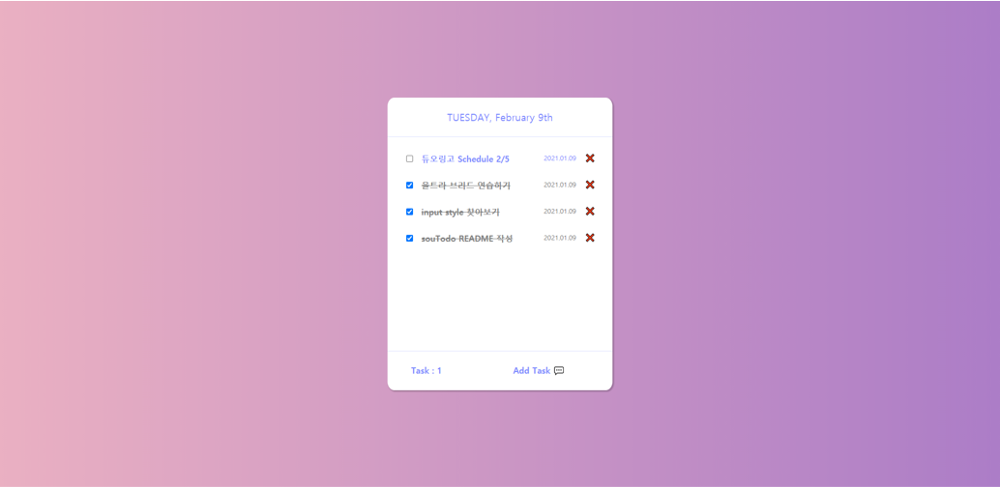

# souTodo
**📋 나만의 Todo List를 작성해보자!**

## 💻 실행화면

### 🎡 메인화면

 

### 🎡 Add Task를 눌렀을 때

 

## 🎯 프로젝트 소개

**"souTodo는 나의 Todo를 적고 완료한 Todo를 체크하거나 삭제할 수 있습니다."**

`souTodo`는 `vanilla JS`를 사용하여 제작한 웹 어플리케이션입니다.

상단부에는 오늘의 날짜를 볼 수 있고 하단부에는 `Todo`의 수와 `Todo`를 입력할 수 있습니다.

**체크박스**를 통해 완료한 `Todo`를 체크할 수 있고 삭제도 가능합니다.😎

### 🔗 [배포주소](https://souvenir718.github.io/souTodo/)